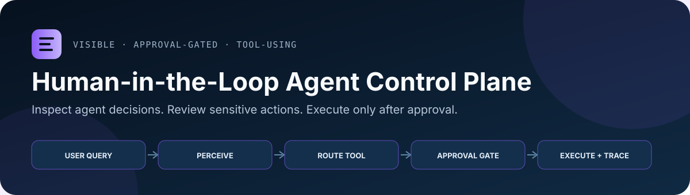
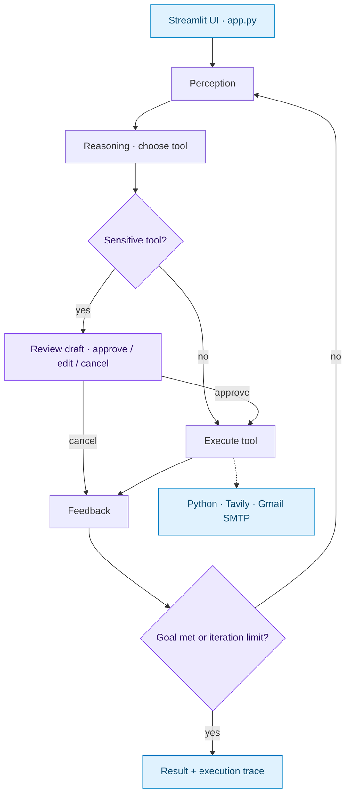

# Human-in-the-Loop Agent Control Plane

<p align="center">
  
</p>

<p align="center">
  
  
  
</p>

<p align="center">
  <a href="#local-setup">Local setup</a> ·
  <a href="#architecture">Architecture</a> ·
  <a href="#review-guide">Review guide</a>
</p>

Streamlit + LangGraph prototype for an environment-controlled AI agent. The agent exposes its perception-reasoning-action-feedback loop, routes work through explicit tools, and requires human approval before sensitive actions such as sending email.

This project is a proof of concept for building AI agents that are useful but not fully autonomous by default: the user can inspect reasoning, review proposed actions, modify drafts, and approve or cancel execution.

## At a Glance

| Area | Implementation signal |
| --- | --- |
| Product problem | Give users visibility and control over tool-using AI agents. |
| Agent workflow | LangGraph state machine with perception, reasoning, action, feedback, and confirmation nodes. |
| Tooling | Python execution, Tavily web search, Gmail draft/send flow, and Streamlit UI. |
| Control model | Human-in-the-loop approval for sensitive tools, including modification before execution. |

## Why This Project

Many agent demos optimize for autonomy. In real customer environments, the harder problem is often control: users need to understand what the agent is doing, which tools it wants to call, and where approval is required.

This prototype explores that control layer:

- make the agent's loop visible rather than hidden;
- separate tool selection from tool execution;
- require confirmation for sensitive actions;
- let the user edit proposed email content before sending;
- keep optional integrations configurable through environment variables.

## Review Guide

If you are scanning this repository, the most relevant implementation areas are:

- `agent.py`: LangGraph workflow, state model, tool routing, confirmation logic, and constrained Python executor.
- `app.py`: Streamlit interface for live reasoning traces, demo prompts, approval UI, and configuration status.
- `.env.example`: local configuration surface for OpenAI, Tavily, Gmail, and model selection.
- `tests/test_agent_smoke.py`: smoke tests for safe local behavior that does not require API keys.
- `DEPLOYMENT.md`: Streamlit Cloud deployment and secret-configuration notes.

## Architecture



## Core Workflow

```text
User query
  -> perception
  -> reasoning / tool selection
  -> action
  -> feedback
  -> final answer

Sensitive action
  -> draft
  -> user review
  -> approve / modify / cancel
  -> execution only after approval
```

## Available Tools

| Tool | Purpose | Approval model |
| --- | --- | --- |
| `run_python` | Local calculation and lightweight data processing | No approval, constrained builtins/modules |
| `search_web` | Real-time lookup through Tavily | No approval, requires `TAVILY_API_KEY` |
| `draft_email` | Generate an email draft | No send side effect |
| `send_email` | Send email through Gmail SMTP | Requires human confirmation |

The Python executor is intentionally constrained, but it is still a prototype-level sandbox. It should not be treated as a production isolation boundary.

## Local Setup

```bash
python3.10 -m venv .venv
source .venv/bin/activate
pip install -r requirements.txt
cp .env.example .env
```

Fill in local credentials in `.env`:

```env
OPENAI_API_KEY=your_openai_api_key
OPENAI_MODEL=gpt-4o
TAVILY_API_KEY=your_tavily_api_key
GMAIL_EMAIL=your_email@gmail.com
GMAIL_APP_PASSWORD=your_gmail_app_password
```

Run the app:

```bash
streamlit run app.py
```

Run smoke tests:

```bash
python -m pytest -q
```

## Configuration

`OPENAI_API_KEY` is required for agent reasoning. `TAVILY_API_KEY` and Gmail credentials are optional; without them, the relevant tools show configuration guidance instead of performing the action.

For Streamlit Cloud, configure secrets in the app settings rather than committing a `.env` file.

## Project Structure

```text
.
├── agent.py              Core agent workflow and tool implementations
├── app.py                Streamlit UI and approval flow
├── DEPLOYMENT.md         Streamlit Cloud deployment notes
├── requirements.txt      Runtime and test dependencies
├── tests/                Smoke tests
└── .env.example          Local configuration template
```


## Integration and extension

Run the Streamlit UI for interactive approvals. For Python callers, `StructuredAgent.run_agent(query, max_iterations=10, timeout=120)` returns the workflow state. The graph's confirmation node uses terminal input; embedding it in an HTTP service requires replacing that interaction with a persisted approval/resume mechanism.

Add a tool in `agent.py`, update its routing and confirmation configuration, and expose any required credentials through the environment. The UI has its own execution/approval orchestration in `app.py`; keep both paths consistent when extending the tool set.

This is a single-process prototype. The constrained Python executor is not an isolation boundary, and the repository does not provide a durable job queue or multi-user approval service.
